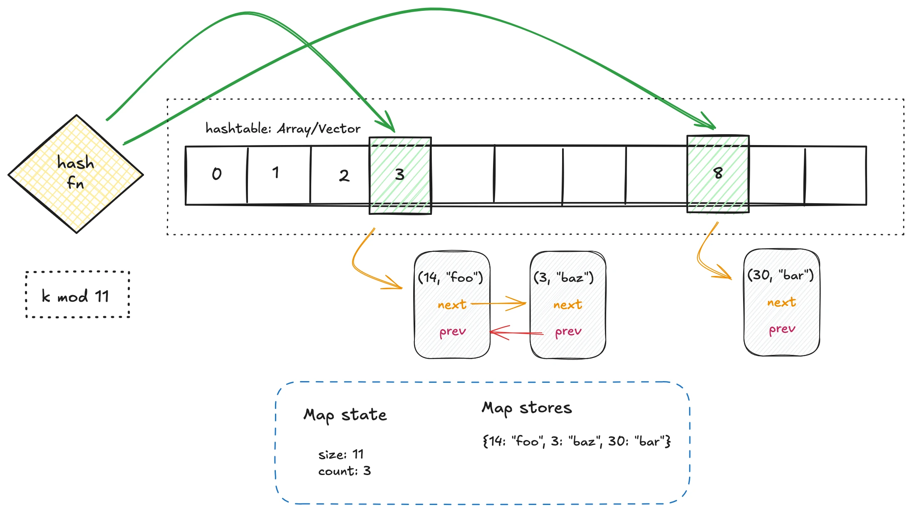
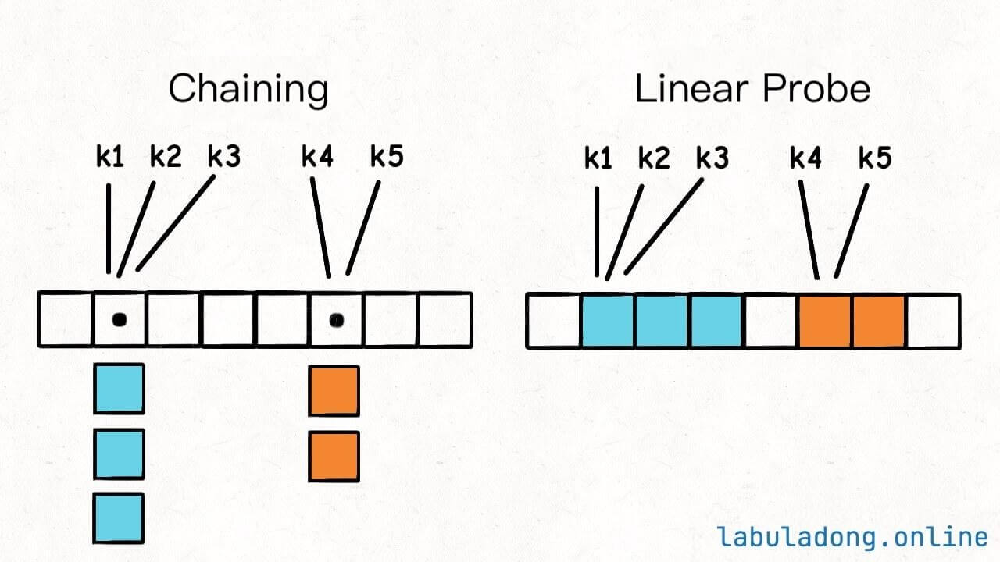

# 🔥 HashMap Internal Working (Simple Explanation)

## 📌 What is HashMap?

HashMap stores data in **key-value pairs**.

Example:

``` java
map.put("ACC123", "Nitin");
```

-   Key = "ACC123"
-   Value = "Nitin"

HashMap internally uses: - `hashCode()` of key - Bucket index
calculation - Array + LinkedList / Tree structure

------------------------------------------------------------------------

# 🧠 Step 1: Internal Structure

Internally, HashMap contains:

-   An **array of buckets**
-   Default capacity = 16

Conceptual view:

    Index:   0   1   2   3   4   5  ... 15
             []  []  []  []  []  []

Each index is called a **bucket**.


------------------------------------------------------------------------

# 🔥 Step 2: How Data is Stored (put)

Example:

``` java
map.put("ACC123", "Nitin");
```

### Step-by-Step:

1.  Java calculates:

        hashCode("ACC123")

2.  Convert hash to bucket index:

        index = hash & (capacity - 1)

3.  Suppose index = 5

4.  Store in:

        bucket[5] → ("ACC123", "Nitin")

------------------------------------------------------------------------

# 🔥 Step 3: Collision Handling

Example:

``` java
map.put("ACC120", "Rahul");
map.put("ACC121", "Amit");
```

If both keys map to index 5:

    bucket[5] →
        Node1 (ACC120)
            ↓
        Node2 (ACC121)

This is called:

👉 **Separate Chaining**


------------------------------------------------------------------------

# 🔥 Step 4: How Data is Retrieved (get)

Example:

``` java
map.get("ACC121");
```

### Steps:

1.  Calculate hashCode of "ACC121"
2.  Find bucket index
3.  Go to bucket\[5\]
4.  Traverse LinkedList
5.  Compare using equals()
6.  Return matched value

------------------------------------------------------------------------

# 🔥 Why equals() is Important

HashMap checks:

    if (node.hash == hash && key.equals(node.key))

So even if two keys have same hashCode, equals() confirms exact match.

------------------------------------------------------------------------

# 🔥 Java 8 Improvement

If bucket size ≥ 8:

-   LinkedList → Converted to Red-Black Tree
-   Improves worst-case performance

------------------------------------------------------------------------

# 🔥 Operation Summary

## PUT

1.  Calculate hashCode
2.  Find bucket index
3.  If empty → store
4.  If not → handle collision

## GET

1.  Calculate hashCode
2.  Find bucket index
3.  Traverse bucket
4.  Match using equals()
5.  Return value

------------------------------------------------------------------------

# ⏱ Time Complexity

  Operation   Average   Worst Case (Java 8+)
  ----------- --------- ----------------------
  put()       O(1)      O(log n)
  get()       O(1)      O(log n)

------------------------------------------------------------------------

# 🎯 Interview One-Line Answer

HashMap stores key-value pairs in an array of buckets. The key's
hashCode determines the bucket index. If multiple keys map to the same
bucket, they are stored using a LinkedList or Red-Black Tree. Retrieval
recalculates the hash and searches within that bucket using equals().
