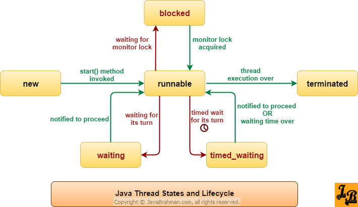
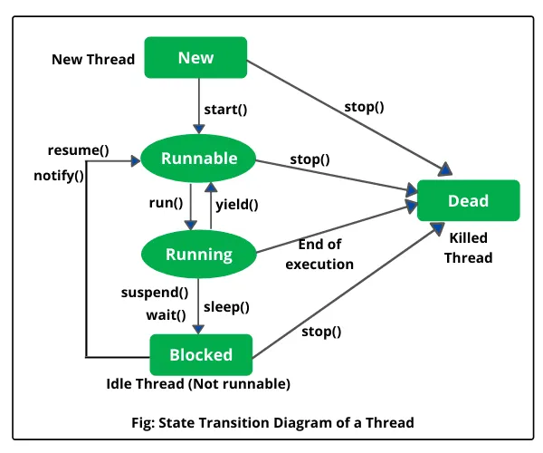

# ✅ Runnable with Thread Lifecycle (Including sleep)

## 🧪 Complete Simple Example

``` java
class MyTask implements Runnable {

    @Override
    public void run() {

        System.out.println("Thread started");

        try {
            // Thread goes to TIMED_WAITING
            Thread.sleep(2000);

        } catch (InterruptedException e) {
            e.printStackTrace();
        }

        System.out.println("Thread finished");
    }
}

public class Test {

    public static void main(String[] args) throws Exception {

        MyTask task = new MyTask();

        Thread t = new Thread(task);

        // 1️⃣ NEW State
        System.out.println("State after creation: " + t.getState());

        t.start();

        // 2️⃣ RUNNABLE State
        System.out.println("State after start(): " + t.getState());

        Thread.sleep(500);

        // 3️⃣ TIMED_WAITING (because of sleep(2000))
        System.out.println("State during sleep: " + t.getState());

        t.join();

        // 4️⃣ TERMINATED
        System.out.println("State after completion: " + t.getState());
    }
}
```

------------------------------------------------------------------------

# 🔄 What Happens Step-by-Step

<p align="center">
  
  
  
</p>

## 🧭 Lifecycle Flow

    NEW
     ↓ start()
    RUNNABLE
     ↓ sleep()
    TIMED_WAITING
     ↓ time over
    RUNNABLE
     ↓ run() ends
    TERMINATED

------------------------------------------------------------------------

# 🔎 State Explanation

## 1️⃣ NEW

``` java
Thread t = new Thread(task);
```

Thread object created but not started.

------------------------------------------------------------------------

## 2️⃣ RUNNABLE

``` java
t.start();
```

Thread ready to run.

------------------------------------------------------------------------

## 3️⃣ TIMED_WAITING

Inside `run()`:

``` java
Thread.sleep(2000);
```

-   Thread pauses for 2 seconds\
-   It does NOT release any lock\
-   State becomes **TIMED_WAITING**

------------------------------------------------------------------------

## 4️⃣ TERMINATED

After `run()` finishes execution.

------------------------------------------------------------------------

# 📌 Important Notes About sleep()

  Property         Value
  ---------------- ----------------------
  Class            Thread
  Static method?   Yes
  Releases lock?   ❌ No
  Causes state     TIMED_WAITING
  Throws           InterruptedException

------------------------------------------------------------------------

# 🔥 Interview-Level Explanation

### What happens internally when `Thread.sleep()` is called?

-   Current thread moves to **TIMED_WAITING**
-   Scheduler pauses execution
-   After time expires, thread returns to **RUNNABLE**
-   It does NOT release monitor lock
-   It throws **InterruptedException** if interrupted

------------------------------------------------------------------------

# 💡 Trick Interview Questions

### ❓ Does sleep() stop thread permanently?

👉 No.\
It pauses thread temporarily.

------------------------------------------------------------------------

### ❓ Can we call sleep() without Thread object?

👉 Yes, because it is static:

``` java
Thread.sleep(2000);
```
