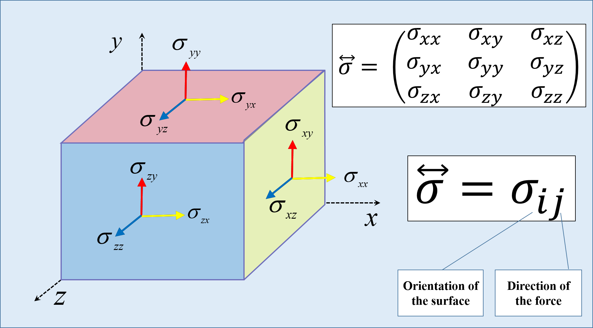
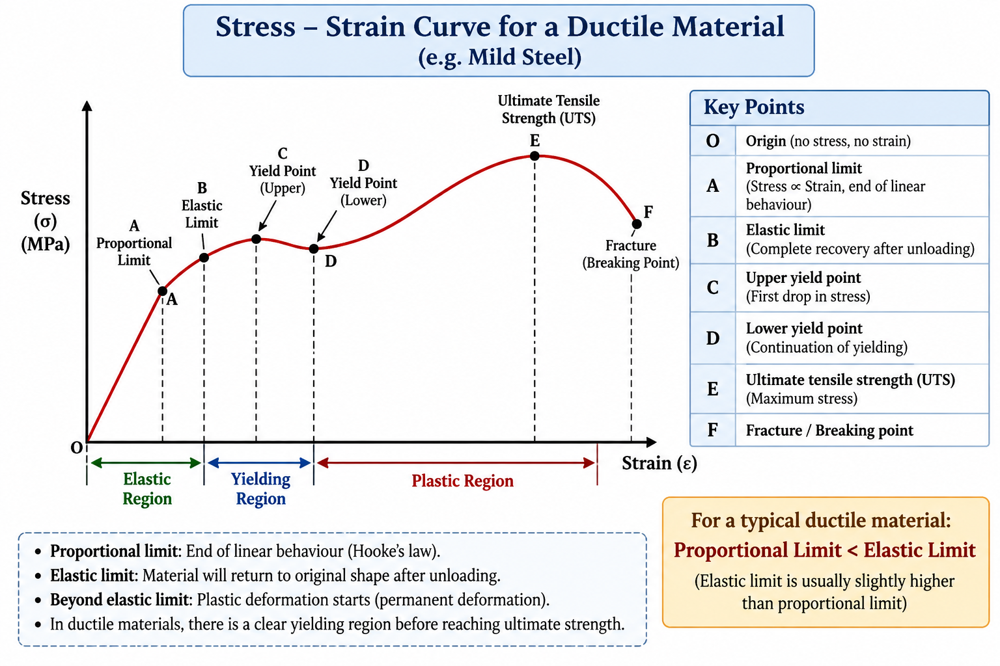

# 🔩 Strength of Materials --- Chapter 1: Simple Stress

## Complete Coverage

``` text
1.1  Load & Internal Resistance
       ↓
1.2  Stress
       ↓
1.3  Types of Stress
       ↓
1.4  Direct Stress
       ↓
1.5  Strain
       ↓
1.6  Types of Strain
       ↓
1.7  Hooke's Law
       ↓
1.8  Elasticity & Plasticity
       ↓
1.9  Proportional & Elastic Limit
       ↓
1.10 Stress-Strain Curve
       ↓
1.11 Poisson's Ratio
       ↓
1.12 Thermal Stress & Strain
       ↓
1.13 Elastic Constants
       ↓
1.14 Relations Between Elastic Constants
```

# 1. Load & Internal Resistance

## 1. Load

A **load** is an external force or system of forces applied to a body.

Examples:

-   Pulling a rod
-   Compressing a column
-   Weight acting on a beam
-   Force acting on a machine component

The SI unit of force/load is:

$$
\boxed{N}
$$

Common engineering units:

$$
1\,kN=1000\,N
$$

$$
1\,MN=10^6\,N
$$

## 2. Internal Resistance

When an external load is applied to a body, the particles inside the
material resist the deformation.

This resistance is called **internal resistance**.

The basic sequence is:

$$
\boxed{
\text{External Load}
\rightarrow
\text{Deformation tendency}
\rightarrow
\text{Internal Resistance}
}
$$

This internal resistance is the basis for defining **stress**.

### AMVI Point

**External load** acts on the body from outside.

**Internal resistance** develops inside the body in response to the
external load.

## 3. Unit Conversions

**Stress** is the internal resisting force developed per unit
cross-sectional area of a loaded body.

$$
\boxed{\sigma=\frac{P}{A}}
$$

where:

-   $P$ = applied load
-   $A$ = cross-sectional area
-   $\sigma$ = stress

### Unit

SI:

$$
\boxed{N/m^2=Pa}
$$

Engineering:

$$
\boxed{N/mm^2=MPa}
$$

Important:

$$
\boxed{1\,N/mm^2=1\,MPa}
$$

### Dimensions

Stress:

$$
\frac{Force}{Area}
$$

$$
=\frac{MLT^{-2}}{L^2}
$$

Therefore:

$$
\boxed{[\sigma]=ML^{-1}T^{-2}}
$$

## 4. Most important conversion ⭐⭐⭐

The most important Strength of Materials conversion is:

$$
\boxed{1\ MPa = 1\ N/mm^2}
$$

Why?

$$
1\ MPa = 10^6\ Pa = 10^6\ N/m^2
$$

Also:

$$
1\ m^2 = 10^6\ mm^2
$$

Therefore:

$$
1\ N/mm^2 = 10^6\ N/m^2
$$

Hence:

$$
\boxed{1\ MPa = 1\ N/mm^2}
$$

#### MPa conversions

$$
\boxed{1\ MPa = 10^6\ Pa}
$$

$$
\boxed{1\ MPa = 10^6\ N/m^2}
$$

$$
\boxed{1\ MPa = 1\ N/mm^2}
$$

$$
\boxed{1\ MPa = 1000\ kPa}
$$

$$
\boxed{1\ MPa = 0.001\ GPa}
$$

##### Example

25 MPa:

$$
25\ MPa = 25\times10^6\ N/m^2
$$

$$
\boxed{25\ MPa = 25\ N/mm^2}
$$

#### GPa conversions

We know:

$$
1\ GPa = 10^9\ Pa
$$

Therefore:

$$
\boxed{1\ GPa = 10^9\ N/m^2}
$$

Since:

$$
1\ GPa = 1000\ MPa
$$

and:

$$
1\ MPa = 1\ N/mm^2
$$

therefore:

$$
\boxed{1\ GPa = 1000\ N/mm^2}
$$

#### Complete conversion

$$
\boxed{
1\ GPa =
1000\ MPa =
1000\ N/mm^2 =
10^9\ Pa =
10^9\ N/m^2
}
$$

#### Pa, kPa, MPa and GPa

| Unit | Equivalent in Pa |
|---|---:|
| 1 Pa | $1$ Pa |
| 1 kPa | $10^3$ Pa |
| 1 MPa | $10^6$ Pa |
| 1 GPa | $10^9$ Pa |

Therefore:

$$
\boxed{1\ GPa = 1000\ MPa = 1,000,000\ kPa}
$$

#### N/m² and N/mm² ⭐⭐⭐

Because:

$$
1\ m = 1000\ mm
$$

then:

$$
1\ m^2 = 10^6\ mm^2
$$

Therefore:

$$
\boxed{1\ N/mm^2 = 10^6\ N/m^2}
$$

and:

$$
\boxed{1\ N/m^2 = 10^{-6}\ N/mm^2}
$$

##### Example

Convert 5 N/mm² to N/m²:

$$
5\times10^6
$$

$$
\boxed{5\ N/mm^2 = 5\times10^6\ N/m^2}
$$

#### N/mm² ↔ MPa

This is the easiest conversion:

$$
\boxed{1\ N/mm^2 = 1\ MPa}
$$

Examples:

$$
50\ N/mm^2 = 50\ MPa
$$

$$
250\ N/mm^2 = 250\ MPa
$$

$$
0.5\ N/mm^2 = 0.5\ MPa
$$

#### GPa → MPa

Multiply by 1000.

Example:

$$
2.5\ GPa = 2.5\times1000\ MPa
$$

$$
\boxed{2.5\ GPa = 2500\ MPa}
$$

#### GPa → N/mm²

$$
2.5\ GPa
=
2.5\times1000\ N/mm^2
$$

$$
\boxed{2.5\ GPa = 2500\ N/mm^2}
$$

#### GPa → N/m²

$$
2.5\ GPa
=
2.5\times10^9\ N/m^2
$$

$$
\boxed{2.5\ GPa = 2.5\times10^9\ N/m^2}
$$

#### CGS unit of stress ⭐

Assuming you mean **CGS** (centimetre–gram–second):

- CGS force unit = **dyne**
- CGS stress unit = **dyne/cm²**

The basic relation is:

$$
\boxed{1\ Pa = 10\ dyne/cm^2}
$$

Therefore:

$$
\boxed{1\ MPa = 10^7\ dyne/cm^2}
$$

and:

$$
\boxed{1\ GPa = 10^{10}\ dyne/cm^2}
$$

Also:

$$
\boxed{1\ N/mm^2 = 10^7\ dyne/cm^2}
$$

#### Other common engineering stress units

### bar

$$
1\ bar = 10^5\ Pa
$$

Therefore:

$$
\boxed{1\ MPa = 10\ bar}
$$

### kgf/cm²

$$
1\ kgf/cm^2 \approx 98,066.5\ Pa
$$

Therefore:

$$
\boxed{1\ kgf/cm^2 \approx 0.0980665\ MPa}
$$

and:

$$
\boxed{1\ MPa \approx 10.1972\ kgf/cm^2}
$$

##### Standard atmosphere

$$
1\ atm = 101325\ Pa
$$

Therefore:

$$
\boxed{1\ atm = 0.101325\ MPa}
$$

and approximately:

$$
\boxed{1\ MPa = 9.869\ atm}
$$

##### psi

$$
1\ psi \approx 6894.76\ Pa
$$

Therefore:

$$
\boxed{1\ MPa \approx 145.038\ psi}
$$

#### Example

A rod has:

$$
P=20\,kN
$$

$$
A=500\,mm^2
$$

Then:

$$
\sigma=\frac{20,000}{500}
$$

$$
\boxed{\sigma=40\,N/mm^2=40\,MPa}
$$

### Important relationship

For constant load:

$$
\sigma\propto\frac{1}{A}
$$

Therefore:

$$
A\uparrow\Rightarrow\sigma\downarrow
$$

# 2. Stress Tensor

### 2.1 What is Stress?

Stress describes the internal force intensity developed inside a body when external loading acts on it.

For simple axial loading:

$$
\sigma=\frac{P}{A}
$$

However, in a general 3D stress state, stress cannot be represented by only one number. The complete stress state at a point is represented by a **second-order tensor**.

### AMVI Point

> **Stress is a second-order tensor.**

### 2.2 3D Stress Tensor
## Components of Stress Tensor

<p align="center">
  
</p>
The general 3D stress tensor can be written as:

$$
[\sigma]=
\begin{bmatrix}
\sigma_{xx} & \tau_{xy} & \tau_{xz}\\
\tau_{yx} & \sigma_{yy} & \tau_{yz}\\
\tau_{zx} & \tau_{zy} & \sigma_{zz}
\end{bmatrix}
$$

There are initially **9 entries** in this matrix:

- 3 normal-stress components
- 6 shear-stress components

### 2.3 Normal stresses

$$
\sigma_{xx},\quad \sigma_{yy},\quad \sigma_{zz}
$$

These act normal/perpendicular to the corresponding faces.

### 2.4 Shear stresses

$$
\tau_{xy},\quad \tau_{xz},\quad \tau_{yx},\quad \tau_{yz},\quad \tau_{zx},\quad \tau_{zy}
$$

These act tangentially to the corresponding faces.

### 2.5 Are There 9 or 6 Independent Stress Components?

 This is an important point from the source notes.\
 General Matrix Has 9 Components

$$
3\text{ normal}+6\text{ shear}=9
$$

But for the **ordinary Cauchy stress tensor in classical continuum mechanics**, the tensor is symmetric when there are no couple stresses/body moments.

Therefore:

$$
\tau_{xy}=\tau_{yx}
$$

$$
\tau_{xz}=\tau_{zx}
$$

$$
\tau_{yz}=\tau_{zy}
$$

So only 6 values are independent:

$$
\boxed{3\text{ normal}+3\text{ independent shear}=6}
$$

The symmetric form is:

$$
[\sigma]=
\begin{bmatrix}
\sigma_x & \tau_{xy} & \tau_{xz}\\
\tau_{xy} & \sigma_y & \tau_{yz}\\
\tau_{xz} & \tau_{yz} & \sigma_z
\end{bmatrix}
$$

### Why are only 6 independent?

The equality of complementary shear components follows from **moment equilibrium / conservation of angular momentum** for the classical Cauchy stress tensor.

### AMVI-MPSC Key Point

> **1. A 3D classical Cauchy stress tensor has 6 independent components: 3 normal + 3 shear.**

> **2. If I want to define stress tranfer in 3D, I required 6 stress only. [3 Normal and 3 Shear]**

### 2.6 ⚠️ Correction / Clarification to the Source Notes

The source notes show the complementary shear stresses as equal in magnitude and opposite in direction and write, for example:

$$
\tau_{xy}=-\tau_{yx}
$$

This wording can be confusing if it is interpreted as a relationship between the **tensor components**.

For the standard Cauchy stress tensor, the component relationship is:

$$
\boxed{\tau_{xy}=\tau_{yx}}
$$

and similarly:

$$
\boxed{\tau_{xz}=\tau_{zx}}
$$

$$
\boxed{\tau_{yz}=\tau_{zy}}
$$

### Why does the source show opposite directions?

On opposite faces of a small element, the actual **traction vectors** must act in opposite directions for force equilibrium. The outward normals of opposite faces are also opposite.

That directional picture should **not** be confused with the equality of the corresponding stress-tensor components.

### Exam Rule

> If the question asks for the **independent components of the classical 3D stress tensor**, answer **6**.

# 3. Stress Tensor vs Force vs Traction

These three ideas should not be mixed.

| Quantity | Meaning | Type |
|---|---|---|
| Force | External/internal resultant force | Vector |
| Traction | Force per unit area acting on a specified plane | Vector |
| Stress tensor | Complete stress state at a point | Second-order tensor |

For a specified plane with unit normal vector $n$, the traction vector is related to the stress tensor by:

$$
\mathbf{t}=\boldsymbol{\sigma}\mathbf{n}
$$

### AMVI Memory

> **Force → Vector**  
> **Traction on a plane → Vector**  
> **Complete stress state → Tensor**

# 4 Types of Stress

                         STRESS
                           │
             ┌─────────────┴─────────────┐
             │                           │
       NORMAL STRESS               SHEAR STRESS
             │                           │
       ┌─────┴─────┐                     │
       │           │                     │
    TENSILE    COMPRESSIVE             SHEAR

The basic types are:
1. Normal Stress - Perpendicular to Surface
2. Shear Stress - Parallel to Surface

## 4.1 Tensile Stress

A pulling force produces tensile stress.

``` text
← P   |────────────|   P →
```

The body tends to elongate.

$$
\boxed{\sigma_t=\frac{P}{A}}
$$

Effects:

-   Length increases
-   Tensile deformation occurs
-   Tensile strain develops

## 4.2 Compressive Stress

A pushing force produces compressive stress.

``` text
P →   |────────────|   ← P
```

The body tends to shorten.

$$
\boxed{\sigma_c=\frac{P}{A}}
$$

Effects:

-   Length decreases
-   Compressive deformation occurs
-   Compressive strain develops

## 4.3 Shear Stress

When a tangential force attempts to make one layer of a material slide
relative to another, shear stress develops.

$$
\boxed{\tau=\frac{P}{A}}
$$

where $P$ is the shear force.

### Important distinction

| Normal Stress       | Shear Stress              |
| ------------------- | ------------------------- |
| Acts normal to area | Acts tangentially to area |
| Tensile             | Shear                     |
| Compressive         | Shear                     |

Thus:

$$
\boxed{\text{Tensile + Compressive = Normal/Direct stress}}
$$

## 4.4 Direct Stress

Direct stress is stress produced by a force acting **along the
longitudinal axis** of a member.

It can be:

-   Tensile direct stress
-   Compressive direct stress

$$
\boxed{\sigma=\frac{P}{A}}
$$

### Example

A straight rod carrying an axial pulling force → tensile direct stress.

A column carrying an axial compressive force → compressive direct
stress.

### AMVI terminology

**Axial load = Direct load** in the basic/simple-stress context.

# 5 Strain

Now connect this to stress.

When load produces stress, the body undergoes deformation.

**Strain measures this deformation relative to the original dimension.**

For longitudinal deformation:

$$
\boxed{\varepsilon=\frac{\Delta L}{L}}
$$

where:

-   $\Delta L$ = change in length
-   $L$ = original length

## Unit of Strain

Since:

$$
\frac{mm}{mm}=1
$$

strain has:

$$
\boxed{\text{No unit}}
$$

It is dimensionless.

It may be expressed as:

-   mm/mm
-   m/m
-   percentage

### Percentage strain

$$
\boxed{\varepsilon_{\%}=\frac{\Delta L}{L}\times100}
$$

## Example

Original length:

$$
L=1000\,mm
$$

Extension:

$$
\Delta L=2\,mm
$$

Therefore:

$$
\varepsilon=\frac{2}{1000}
$$

$$
\boxed{\varepsilon=0.002}
$$

or:

$$
\boxed{0.2\%}
$$

## 5.1 Types of Strain

There are four important types.

## 5.1.1 Longitudinal Strain

Change in length/original length:

$$
\boxed{\varepsilon_L=\frac{\Delta L}{L}}
$$

It can be:

-   Tensile strain
-   Compressive strain

## 5.1.2 Lateral Strain

When a rod is subjected to tensile load:

-   Length increases
-   Diameter decreases

The change in lateral dimension relative to original lateral dimension
is **lateral strain**.

$$
\boxed{\varepsilon_{lat}=\frac{\Delta d}{d}}
$$

## 5.1.3 Shear Strain

Shear loading changes the angular shape of the body.

Shear strain is represented by:

$$
\boxed{\gamma}
$$

For small deformation:

$$
\boxed{\gamma\approx\phi}
$$

where $\phi$ is the angular deformation in radians.

## 5.1.4 Volumetric Strain

Change in volume/original volume:

$$
\boxed{\varepsilon_v=\frac{\Delta V}{V}}
$$

> Yes. The **basic definition is always the same**:

$$
\boxed{\varepsilon_v=\frac{\Delta V}{V}}
$$

For a small deformation, volumetric strain can also be written as the **sum of strains in three mutually perpendicular directions**:

$$
\boxed{\varepsilon_v=\varepsilon_x+\varepsilon_y+\varepsilon_z}
$$

### General 3D Stress State — Important Distinction

For an isotropic material:

$$
\varepsilon_x=\frac{1}{E}[\sigma_x-\mu(\sigma_y+\sigma_z)]
$$

$$
\varepsilon_y=\frac{1}{E}[\sigma_y-\mu(\sigma_x+\sigma_z)]
$$

$$
\varepsilon_z=\frac{1}{E}[\sigma_z-\mu(\sigma_x+\sigma_y)]
$$

Adding them:

$$
\boxed{ \varepsilon_v = \frac{1-2\mu}{E} (\sigma_x+\sigma_y+\sigma_z) }
$$

This is the general 3D relation for an isotropic, linear-elastic material.
Let's derive it for each shape.

### 1. Circular Cylinder / Solid Round Rod

Consider a cylindrical rod:

* Original diameter = $d$
* Original length = $L$

Volume:

$$
V=\frac{\pi d^2L}{4}
$$

For small deformation:

* Longitudinal strain = $\varepsilon_L$
* Lateral strain in diameter direction = $\varepsilon_d$

Since the diameter has **two perpendicular lateral directions**, both lateral strains are $\varepsilon_d$.

Therefore:

$$
\boxed{\varepsilon_v=\varepsilon_L+2\varepsilon_d}
$$

Using Poisson's ratio:

$$
\nu=-\frac{\varepsilon_d}{\varepsilon_L}
$$

Therefore:

$$
\varepsilon_d=-\nu\varepsilon_L
$$

Substitute:

$$
\boxed{\varepsilon_v=\varepsilon_L(1-2\nu)}
$$

### For tensile loading

$$
\varepsilon_L>0
$$

and

$$
\varepsilon_d<0
$$

So:

$$
\varepsilon_v=\varepsilon_L+2\varepsilon_d
$$

### For compression

$$
\varepsilon_L<0
$$

and

$$
\varepsilon_d>0
$$

Again:

$$
\boxed{\varepsilon_v=\varepsilon_L+2\varepsilon_d}
$$

### 2. Rectangular Bar

Consider a rectangular bar:

* Length = $L$
* Width = $b$
* Thickness = $t$

Volume:

$$
V=Lbt
$$

There are three mutually perpendicular dimensions:

```text
             Length → L
        ┌────────────────┐
       /                /│
      /                / │
     └────────────────┘  │
     │                │  │
     │                │ /
     │                │/
     └────────────────┘

       b = width
       t = thickness
```

Therefore:

* Strain along length = $\varepsilon_L$
* Strain along width = $\varepsilon_b$
* Strain along thickness = $\varepsilon_t$

Hence:

$$
\boxed{\varepsilon_v=\varepsilon_L+\varepsilon_b+\varepsilon_t}
$$

If the material is under **uniaxial loading along the length**, the two lateral strains are equal:

$$
\varepsilon_b=\varepsilon_t=\varepsilon_{lat}
$$

Therefore:

$$
\boxed{\varepsilon_v=\varepsilon_L+2\varepsilon_{lat}}
$$

And using Poisson's ratio:

$$
\boxed{\varepsilon_v=\varepsilon_L(1-2\nu)}
$$

### Important point

For a rectangular bar under axial loading, the formula is **the same as the circular rod**.

Why?

Because there are:

* **1 longitudinal direction**
* **2 perpendicular lateral directions**

### 3. Sphere

Now consider a sphere of radius $r$.

Original volume:

$$
V=\frac{4}{3}\pi r^3
$$

For a sphere under **uniform expansion/compression**, deformation occurs equally in all three mutually perpendicular directions.

Therefore:

$$
\varepsilon_x=\varepsilon_y=\varepsilon_z=\varepsilon
$$

Hence:

$$
\varepsilon_v
=
\varepsilon+\varepsilon+\varepsilon
$$

So:

$$
\boxed{\varepsilon_v=3\varepsilon}
$$

### Using Poisson's ratio?

For a sphere under **uniform hydrostatic stress**, the situation is different from a simple uniaxial rod.

The three normal strains are equal:

$$
\boxed{\varepsilon_x=\varepsilon_y=\varepsilon_z}
$$

and therefore:

$$
\boxed{\varepsilon_v=3\varepsilon}
$$

### 4. Taper Bar

For a **circular rod uniformly tapered from $d_1$ to $d_2$**:

$$
\boxed{\Delta L=\frac{4PL}{\pi E d_1d_2}}
$$

### Comparison — Very Important for AMVI

| Shape / Loading                                   | Volumetric strain                                                 |
| ------------------------------------------------- | ----------------------------------------------------------------- |
| Circular rod, axial loading                       | $\boxed{\varepsilon_v=\varepsilon_L+2\varepsilon_{lat}}$          |
| Rectangular bar, axial loading                    | $\boxed{\varepsilon_v=\varepsilon_L+\varepsilon_b+\varepsilon_t}$ |
| Rectangular bar, uniaxial + equal lateral strains | $\boxed{\varepsilon_v=\varepsilon_L+2\varepsilon_{lat}}$          |
| Sphere, uniform deformation                       | $\boxed{\varepsilon_v=3\varepsilon}$                              |
| Any 3D state                                      | $\boxed{\varepsilon_v=\varepsilon_x+\varepsilon_y+\varepsilon_z}$ |

### 🔥 Most important concept

Don't memorize the shape-specific formulas first. Remember:

$$
\boxed{\text{Volumetric strain = sum of strains in 3 perpendicular directions}}
$$

Then:

### Rod under axial load

**1 longitudinal + 2 lateral**

$$
\boxed{\varepsilon_v=\varepsilon_L+2\varepsilon_{lat}}
$$

### Rectangular bar under axial load

**1 length + 2 lateral**

$$
\boxed{\varepsilon_v=\varepsilon_L+\varepsilon_b+\varepsilon_t}
$$

### Sphere under uniform deformation

**3 equal directions**

$$
\boxed{\varepsilon_v=3\varepsilon}
$$

And one very useful special case:

If $\nu=0.5$ for a uniaxially loaded isotropic material,

$$
\varepsilon_v=\varepsilon_L(1-2\nu)
$$

$$
\varepsilon_v=\varepsilon_L(1-1)=0
$$

So:

> **$\nu=0.5$ → zero volumetric strain → approximately incompressible material.**

## Quick Table

| **Strain**   | **Formula**          | **Represents**                 |
|--------------|----------------------|--------------------------------|
| Longitudinal | $\Delta L/L$         | Change in length               |
| Lateral      | $\Delta d/d$         | Change in lateral dimension    |
| Shear        | $\gamma\approx\phi$  | Angular deformation            |
| Volumetric   | $\Delta V/V$         | Change in volume               |

## 5.2 Hooke's Law

This is one of the most important concepts in SOM.

### Statement

> Within the proportional limit, stress is directly proportional to
> strain.

$$
\boxed{\sigma\propto\varepsilon}
$$

Therefore:

$$
\boxed{\frac{\sigma}{\varepsilon}=constant}
$$

For normal stress, this constant is Young's modulus $E$:

$$
\boxed{E=\frac{\sigma}{\varepsilon}}
$$

Therefore:

$$
\boxed{\sigma=E\varepsilon}
$$

## For Shear

Similarly:

$$
\boxed{\tau=G\gamma}
$$

where:

-   $G$ = modulus of rigidity
-   $\tau$ = shear stress
-   $\gamma$ = shear strain

## 5.3 Stress-Strain Curve
<p align="center">
  
</p>

For a typical **mild steel/ductile material**, the important sequence
is:

## Stress–Strain Curve — Ductile Material

The curve plots:

* **Y-axis → Stress, $\sigma$**
* **X-axis → Strain, $\varepsilon$**

The typical curve can be understood in **six important stages**.

### 1. O → A : Linear / Proportional Region

At the beginning, the curve is almost a straight line.

Here:

$$
\sigma \propto \varepsilon
$$

Therefore, Hooke's law applies:

$$
\sigma=E\varepsilon
$$

where $E$ is Young's modulus.

**Point A = Proportional Limit**

At this point, stress is still proportional to strain.

> **AMVI:** Proportional limit = **end of linear relationship** between stress and strain.

### 2. A → B : Elastic Region

After the proportional limit, the curve may become slightly nonlinear.

However, the material can still return to its original shape if the load is removed.

**Point B = Elastic Limit**

At or below the elastic limit:

> **No permanent deformation remains after unloading.**

So:

```text
O → B  = Elastic region
Beyond B = Plastic deformation begins
```

### Important difference

| Proportional Limit                             | Elastic Limit                                  |
| ---------------------------------------------- | ---------------------------------------------- |
| End of linear behavior                         | End of elastic behavior                        |
| Stress proportional to strain up to this point | Complete recovery is possible up to this point |
| Usually occurs first                           | Usually slightly higher                        |

Therefore, for a typical ductile material:

$$
\boxed{\text{Proportional Limit < Elastic Limit}}
$$

### 3. B → C → D : Yielding Region

After the elastic limit, the material begins to undergo **permanent deformation**.

For mild steel, we commonly see:

* **Upper Yield Point (C)**
* **Lower Yield Point (D)**

The stress may actually drop after reaching the upper yield point.

This means the material can continue deforming considerably without a corresponding increase in stress.

### Key idea

> **Yielding = large plastic strain occurs with relatively little change in stress.**

For AMVI, remember:

```text
Upper Yield Point
       ↓
Stress drops
       ↓
Lower Yield Point
       ↓
Plastic deformation continues
```

### 4. D → E : Strain Hardening Region

After yielding, the material continues to deform plastically.

But now, more stress is required to continue deformation.

This is called **strain hardening** or **work hardening**.

The curve rises again.

Eventually it reaches point **E**.

### 5. Point E : Ultimate Tensile Strength (UTS)

Point E represents the **maximum engineering stress** reached during the tensile test.

$$
\boxed{\text{UTS}=\frac{\text{Maximum Load}}{\text{Original Cross-sectional Area}}}
$$

This is a very important MCQ point.

> **UTS = maximum engineering stress on the stress–strain curve.**

After UTS, the engineering stress starts decreasing.

### 6. E → F : Necking and Fracture

After UTS, **necking** begins in a typical ductile tensile specimen.

The cross-sectional area becomes locally smaller at one region.

Because engineering stress is calculated using the **original area**, the engineering stress shown on the graph decreases.

Eventually the specimen breaks.

**Point F = Fracture / Breaking Point**

## Complete Curve in One Flow

```text
O
│
│  Linear region
│      ↓
│  Proportional Limit
│      ↓
│  Elastic Limit
│      ↓
│  Upper Yield Point
│      ↓
│  Lower Yield Point
│      ↓
│  Strain Hardening
│      ↓
│  UTS
│      ↓
│  Necking
│      ↓
│  Fracture
└────────────────────→ Strain
```

## Most Important AMVI-MPSC Memory Map

| Point/Region | What happens              |
| ------------ | ------------------------- |
| **O**        | Origin                    |
| **A**        | Proportional limit        |
| **B**        | Elastic limit             |
| **C**        | Upper yield point         |
| **D**        | Lower yield point         |
| **D → E**    | Strain hardening          |
| **E**        | Ultimate tensile strength |
| **E → F**    | Necking                   |
| **F**        | Fracture                  |

### 🔥 5 One-Liner MCQ Facts

1. **Slope of initial straight portion = Young's modulus $E$.**
2. **Proportional limit → end of linear behavior.**
3. **Elastic limit → end of elastic behavior.**
4. **UTS → maximum engineering stress.**
5. **Fracture → specimen finally breaks.**

### One concept you should remember

**Elastic deformation is recoverable; plastic deformation is permanent.**

So the most important boundary on this curve is:

$$
\boxed{\text{Elastic Limit}}
$$

### Beyond the elastic limit **Permanent deformation remains even after removing the load.**

## 🔥 Sequence for MCQ

$$
\boxed{
\text{Proportional Limit}
\rightarrow
\text{Elastic Limit}
\rightarrow
\text{Yield}
\rightarrow
\text{Strain Hardening}
\rightarrow
\text{Ultimate Stress}
\rightarrow
\text{Necking}
\rightarrow
\text{Fracture}
}
$$

## 5.4 Elasticity & Plasticity

## 5.4.1 Elasticity

Ability of a material to regain its original dimensions after removal of
load.

$$
\boxed{\text{Load removed}\rightarrow\text{Original dimensions}}
$$

Example: spring under normal elastic loading.

## 5.4.2 Plasticity

Ability of a material to undergo permanent deformation.

After removing the load:

$$
\boxed{\text{Permanent deformation remains}}
$$

### Comparison
| **Elastic Deformation**       | **Plastic Deformation**          |
|-------------------------------|-----------------------------------|
| Temporary                     | Permanent                         |
| Original shape recovered      | Original shape not fully recovered |
| Within elastic range          | Beyond elastic limit              |

## 5.4.3 Proportional Limit & Elastic Limit

These two are frequently confused.

### Proportional Limit

The maximum stress up to which:

$$
\boxed{\sigma\propto\varepsilon}
$$

That means the stress-strain graph remains linear.

### Elastic Limit

The maximum stress up to which the material completely regains its
original dimensions after removal of load.

Beyond elastic limit:

$$
\boxed{\text{Permanent deformation occurs}}
$$

### Difference

| **Proportional Limit**             | **Elastic Limit**                    |
|------------------------------------|--------------------------------------|
| Stress proportional to strain      | Complete recovery after unloading    |
| Defines end of linear behaviour     | Defines end of elastic behaviour     |
| Usually occurs first               | Usually slightly higher              |

**Proportional Limit < Elastic Limit** -> For **Ductile Material**
> **Note:** For a typical ductile material, the proportional limit usually occurs slightly before the elastic limit.

$$
\boxed{\text{Proportional Limit}<\text{Elastic Limit}}
$$

# 6 Poisson's Ratio

When a bar is subjected to tensile load:

-   Length increases
-   Diameter decreases

Therefore, two strains are produced:

**Longitudinal strain**

and

**Lateral strain**

Poisson's ratio is defined as the ratio of lateral strain to
longitudinal strain.

$$
\boxed{\nu=-\frac{\text{Lateral strain}}{\text{Longitudinal strain}}}
$$

The negative sign is used because lateral and longitudinal strains have
opposite signs under tensile loading.

### Example

Suppose:

$$
\text{Longitudinal strain}=0.002
$$

$$
\text{Lateral strain}=-0.0006
$$

Then:

$$
\nu=-\frac{-0.0006}{0.002}
$$

$$
\boxed{\nu=0.3}
$$

### Important

Poisson's ratio is:

$$
\boxed{\text{Dimensionless}}
$$

It has no unit.

# 7. Elastic Constants

**Elastic constants** are material properties that describe the relationship between **stress and strain within the elastic limit**.

For an isotropic, linear-elastic material, the important elastic constants are:

1. **Young's Modulus — $E$**
2. **Modulus of Rigidity / Shear Modulus — $G$**
3. **Bulk Modulus — $K$**
4. **Poisson's Ratio — $\mu$ or $\nu$**

## 1. Young's Modulus — $E$

Young's modulus represents the resistance of a material to **longitudinal deformation**.

$$
\boxed{E=\frac{\text{Longitudinal stress}}{\text{Longitudinal strain}}}
$$

For axial loading:

$$
\boxed{E=\frac{\sigma}{\varepsilon_L}}
$$

where:

* $E$ = Young's modulus
* $\sigma$ = normal/direct stress
* $\varepsilon_L$ = longitudinal strain

**Unit:** Pa, MPa, GPa, or N/mm²

Higher $E$ → material undergoes **less elastic deformation** for the same stress.

## 2. Modulus of Rigidity — $G$

Also called:

* **Shear modulus**
* **Modulus of rigidity**

It represents the resistance of a material to **shear deformation**.

$$
\boxed{G=\frac{\text{Shear stress}}{\text{Shear strain}}}
$$

Therefore:

$$
\boxed{G=\frac{\tau}{\gamma}}
$$

where:

* $G$ = shear modulus
* $\tau$ = shear stress
* $\gamma$ = shear strain

**Unit:** Pa, MPa, GPa or N/mm²

## 3. Bulk Modulus — $K$

Bulk modulus represents the resistance of a material to **change in volume**.

$$
\boxed{K=\frac{\text{Hydrostatic stress}}{\text{Volumetric strain}}}
$$

Usually:

$$
\boxed{K=-\frac{p}{\varepsilon_v}}
$$

where:

* $K$ = bulk modulus
* $p$ = hydrostatic pressure
* $\varepsilon_v$ = volumetric strain

The negative sign is used because pressure causes a **decrease in volume**.

**Unit:** Pa, MPa, GPa or N/mm²

## 4. Poisson's Ratio — $\mu$ or $\nu$

Poisson's ratio represents the relationship between **lateral strain and longitudinal strain**.

$$
\boxed{\mu=-\frac{\varepsilon_{lat}}{\varepsilon_L}}
$$

or

$$
\boxed{\nu=-\frac{\varepsilon_{lat}}{\varepsilon_L}}
$$

It is **dimensionless**.

## Important Relations Between Elastic Constants

> For an **isotropic, homogeneous, linear-elastic material**:

### Relation between $E$, $G$ and $\mu$

$$
\boxed{E=2G(1+\mu)}
$$

Therefore:

$$
\boxed{G=\frac{E}{2(1+\mu)}}
$$

### Relation between $E$, $K$ and $\mu$

$$
\boxed{E=3K(1-2\mu)}
$$

Therefore:

$$
\boxed{K=\frac{E}{3(1-2\mu)}}
$$

### Relation between $K$, $G$ and $\mu$

$$
\boxed{K=\frac{2G(1+\mu)}{3(1-2\mu)}}
$$

### Relation between $E$, $K$ and $G$

$$
\boxed{E=\frac{9KG}{3K+G}}
$$

# 🔥 AMVI/MPSC Formula Table

| Elastic Constant |         Symbol | Definition                                | Unit          |
| ---------------- | -------------: | ----------------------------------------- | ------------- |
| Young's modulus  |            $E$ | Longitudinal stress / longitudinal strain | Pa            |
| Shear modulus    |            $G$ | Shear stress / shear strain               | Pa            |
| Bulk modulus     |            $K$ | Hydrostatic stress / volumetric strain    | Pa            |
| Poisson's ratio  | $\mu$ or $\nu$ | − lateral strain / longitudinal strain    | Dimensionless |

### Most important formulas to remember

$$
\boxed{E=2G(1+\mu)}
$$

$$
\boxed{E=3K(1-2\mu)}
$$

$$
\boxed{E=\frac{9KG}{3K+G}}
$$

$$
\boxed{G=\frac{E}{2(1+\mu)}}
$$

$$
\boxed{K=\frac{E}{3(1-2\mu)}}
$$

**Memory:**
**E → Length**
**G → Shape / Shear**
**K → Volume**
**μ → Lateral vs Longitudinal**

# 8. Material Classification

These terms are important in **Strength of Materials** because they describe how a material behaves in different directions.

## 1. Homogeneous Material

A material is **homogeneous** when its properties are the **same at every location within the material**.

In simple words:

> **Same material properties from point to point.**

For example, if Young's modulus $E$ is the same throughout the material, it is homogeneous with respect to $E$.

### Example

* Mild steel (idealized as a uniform material)
* Aluminium (idealized as uniform)
* Copper

### Simple example

Imagine a steel bar:

```text
|----------------------------|
  E = 200 GPa throughout
|----------------------------|
```

Every portion has approximately the same material properties.

## 2. Isotropic Material

A material is **isotropic** when its properties are **the same in all directions at a given point**.

In simple words:

> **Same properties in every direction.**

For an isotropic material:

$$
E_x=E_y=E_z
$$

and the material behaves similarly regardless of the direction of loading.

### Examples

* Glass
* Most metals such as steel and aluminium, when treated as isotropic in engineering analysis
* Rubber, when modeled as isotropic

### Example

Imagine a small element:

```text
          ↑
          │ E
          │
     E ← [■] → E
          │
          ↓
          E
```

The material has the same elastic response in different directions.

## 3. Anisotropic Material

A material is **anisotropic** when its properties **depend on the direction**.

In simple words:

> **Different properties in different directions.**

For example:

$$
E_x\neq E_y
$$

### Examples

* Wood
* Carbon-fiber composites
* Many fiber-reinforced composites

### Wood example

Wood behaves differently:

```text
          Grain direction
               ↑
               │
               │
        ───────┼───────
               │
               │
```

Its strength and stiffness **along the grain** are different from those **across the grain**.

## 4. Orthotropic Material

**Orthotropic material is a special type of anisotropic material.**

It has different material properties along **three mutually perpendicular directions**, called the **principal material directions**.

Usually:

$$
E_x\neq E_y\neq E_z
$$

### Examples

* Wood
* Fiber-reinforced composites
* Rolled metal sheets can exhibit orthotropic behavior due to processing

### Wood example

For wood, we commonly consider:

1. **Longitudinal (L)** → along the grain
2. **Radial (R)** → perpendicular to grain
3. **Tangential (T)** → tangent to growth rings

These directions have different mechanical properties.

## Isotropic vs Anisotropic vs Orthotropic

| Material type   | Meaning                                          | Properties                                      | Example                |
| --------------- | ------------------------------------------------ | ----------------------------------------------- | ---------------------- |
| **Homogeneous** | Same from point to point                         | Location-independent                            | Uniform steel          |
| **Isotropic**   | Same in all directions                           | Direction-independent                           | Glass, idealized steel |
| **Anisotropic** | Different in different directions                | Direction-dependent                             | Wood, composites       |
| **Orthotropic** | Different in 3 mutually perpendicular directions | Direction-dependent with 3 principal directions | Wood, fiber composites |

## 🔥 Very Important: Homogeneous ≠ Isotropic

These are **two different concepts**.

### Homogeneous asks:

> **Does the property change from one location to another?**

### Isotropic asks:

> **Does the property change when I change the direction?**

Therefore, a material can be:

* **Homogeneous + isotropic**
* **Homogeneous + anisotropic**
* **Non-homogeneous + isotropic**
* **Non-homogeneous + anisotropic**

### Easy memory trick

**HOMO → Location**

**ISO → Same direction**

**ANISO → Different direction**

**ORTHO → 3 perpendicular directions**

# 7. For **self-weight elongation**, compare the two cases as follows.

## 1. Uniform Vertical Bar

For a uniform bar of length $L$, area $A$, total weight $W$:

$$
\boxed{\delta=\frac{WL}{2AE}}
$$

Since:

$$
W=\rho gAL
$$

Therefore:

$$
\boxed{\delta=\frac{\rho gL^2}{2E}}
$$

## 2. Solid Conical Bar

For a solid conical bar of length $L$, with the **larger end at the top**, base area $A$, and total weight $W$:

$$
\boxed{\delta=\frac{WL}{2AE}}
$$

But for a cone:

$$
W=\frac{1}{3}\rho gAL
$$

Therefore:

$$
\boxed{\delta=\frac{\rho gL^2}{6E}}
$$

## Comparison

| Bar             | Self-weight elongation                                             |
| --------------- | ------------------------------------------------------------------ |
| **Uniform bar** | $\displaystyle \boxed{\delta=\frac{WL}{2AE}=\frac{\rho gL^2}{2E}}$ |
| **Conical bar** | $\displaystyle \boxed{\delta=\frac{WL}{2AE}=\frac{\rho gL^2}{6E}}$ |

### Important correction

The expression $\frac{WL}{2AE}$ **cannot be used with the cone's total weight and base area as a general derivation**; it happens to give the correct cone result only because of the cone geometry and the $1/3$ volume factor when interpreted with the base area. The safest AMVI formula to memorize for a **solid cone, larger end at top** is:

$$
\boxed{\delta=\frac{\rho gL^2}{6E}}
$$

Thus, for the same $L$, $\rho$, and $E$:

$$
\boxed{\delta_{\text{cone}}=\frac{1}{3}\delta_{\text{uniform}}}
$$

# 8. Thermal Expansion — Change in Length

### Concept

When the temperature of a bar changes, the bar **expands or contracts**.

* Temperature increases → **length increases**
* Temperature decreases → **length decreases**
* If the bar is free to expand/contract → **no thermal stress develops**

### Formula

$$
\boxed{\Delta L=\alpha L\Delta T}
$$

### Terms and Units

| Symbol     | Meaning                                 | SI Unit              |
| ---------- | --------------------------------------- | -------------------- |
| $\Delta L$ | Change in length                        | m                    |
| $\alpha$   | Coefficient of linear thermal expansion | $1/K$ or $/^\circ C$ |
| $L$        | Original length                         | m                    |
| $\Delta T$ | Change in temperature                   | K or $^\circ C$      |

### Temperature Change

$$
\boxed{\Delta T=T_2-T_1}
$$

Therefore:

* Heating: $\Delta T>0$ → $\Delta L>0$ → **Expansion**
* Cooling: $\Delta T<0$ → $\Delta L<0$ → **Contraction**

### Thermal Strain

$$
\boxed{\varepsilon_{th}=\frac{\Delta L}{L}=\alpha\Delta T}
$$

Thermal strain is **dimensionless**.

## Thermal Expansion — 3 Cases

The basic **free thermal expansion** of a bar is:

$$
\boxed{\Delta L_{free}=\lambda L\Delta T}
$$

where $\lambda$ is the coefficient of linear expansion.

## 1. Free Expansion

The bar is **completely free to expand or contract**.

### Description

When temperature increases, the bar expands by its natural thermal expansion.

$$
\boxed{\Delta L_{actual}=\Delta L_{free}=\lambda L\Delta T}
$$

Thermal strain:

$$
\boxed{\varepsilon_{th}=\lambda\Delta T}
$$

Since there is no restraint:

$$
\boxed{\sigma_{th}=0}
$$

### Key point

> **Free expansion → Full expansion + Zero thermal stress**

## 2. Completely Fixed / Fully Restrained

Both ends are fixed, so the bar **cannot change its length**.

### Description

The bar wants to expand by:

$$
\Delta L_{free}=\lambda L\Delta T
$$

but:

$$
\boxed{\Delta L_{actual}=0}
$$

The entire free expansion is prevented, producing thermal stress.

Thermal stress:

$$
\boxed{\sigma_{th}=E\lambda\Delta T}
$$

For **heating**:

$$
\boxed{\sigma_{th}=E\lambda\Delta T}
$$

→ **Compressive stress**

For **cooling**:

$$
\boxed{\sigma_{th}=E\lambda|\Delta T|}
$$

→ **Tensile stress**

### Key point

> **Complete restraint → Zero expansion + Maximum thermal stress**

## 3. Partially Fixed / Partially Restrained

The bar is allowed to expand **partially**, but not by its complete free expansion.

Suppose:

* Free expansion = $\Delta L_{free}$
* Actual expansion = $\Delta L_{actual}$

Then:

$$
\boxed{
\Delta L_{prevented}
=
\Delta L_{free}-\Delta L_{actual}
}
$$

Since:

$$
\Delta L_{free}=\lambda L\Delta T
$$

Therefore:

$$
\boxed{
\Delta L_{prevented}
=
\lambda L\Delta T-\Delta L_{actual}
}
$$

The restrained strain is:

$$
\boxed{
\varepsilon_{restrained}
=
\frac{\Delta L_{prevented}}{L}
}
$$

Therefore thermal stress is:

$$
\boxed{
\sigma_{th}
=
E\frac{\Delta L_{prevented}}{L}
}
$$

Substituting:

$$
\boxed{
\sigma_{th}
=
E\left(
\lambda\Delta T-
\frac{\Delta L_{actual}}{L}
\right)
}
$$

### Key point

> **Partial restraint → Partial expansion + Partial thermal stress**

### 🔥 Comparison of All 3 Cases

| Case                     | Actual expansion                    | Thermal stress                     |
| ------------------------ | ----------------------------------- | ---------------------------------- |
| **Free expansion**       | $\lambda L\Delta T$                 | $0$                                |
| **Completely fixed**     | $0$                                 | $E\lambda\Delta T$                 |
| **Partially restrained** | Between $0$ and $\lambda L\Delta T$ | Between $0$ and $E\lambda\Delta T$ |

### Easy AMVI Memory

$$
\boxed{\text{Free} \rightarrow \text{Expansion only}}
$$

$$
\boxed{\text{Fully fixed} \rightarrow \text{Stress only}}
$$

$$
\boxed{\text{Partially fixed} \rightarrow \text{Expansion + Stress}}
$$

For heating, the restraint-induced thermal stress is **compressive**; for cooling, it is **tensile**. 

# 9.0  Composite Bars
Yes. For **composite bars**, the two important arrangements are **bars in series** and **bars in parallel**. The key difference is whether the **load or deformation is common**.

## 1. Bars in Series

Bars are connected **end-to-end**.

```text
        P
        ↓
   ┌────────┐
   │ Bar 1  │  L₁, A₁, E₁
   └────────┘
   ┌────────┐
   │ Bar 2  │  L₂, A₂, E₂
   └────────┘
        ↑
```

### Key concept

For bars in **series**:

> **Same load acts through each bar, but elongation is different.**

Therefore:

$$
\boxed{P_1=P_2=P}
$$

### Stress in each bar

$$
\boxed{\sigma_1=\frac{P}{A_1}}
$$

$$
\boxed{\sigma_2=\frac{P}{A_2}}
$$

So, if areas are different:

$$
\boxed{\sigma_1\neq\sigma_2}
$$

### Change in length of each bar

For Bar 1:

$$
\boxed{\Delta L_1=\frac{PL_1}{A_1E_1}}
$$

For Bar 2:

$$
\boxed{\Delta L_2=\frac{PL_2}{A_2E_2}}
$$

### Total change in length

$$
\boxed{\Delta L=\Delta L_1+\Delta L_2}
$$

Therefore:

$$
\boxed{
\Delta L=
\frac{PL_1}{A_1E_1}
+
\frac{PL_2}{A_2E_2}
}
$$

### Strain

For each bar:

$$
\boxed{\varepsilon_1=\frac{\sigma_1}{E_1}}
$$

$$
\boxed{\varepsilon_2=\frac{\sigma_2}{E_2}}
$$

## 2. Bars in Parallel

Bars are connected **side-by-side** between the same two rigid plates.

```text
             P
             ↓
        ┌─────────┐
        │ Rigid   │
        │  plate  │
        └─┬─────┬─┘
          │     │
       ┌──┐   ┌──┐
       │  │   │  │
       │A₁│   │A₂│
       │E₁│   │E₂│
       │  │   │  │
       └──┘   └──┘
          │     │
        ┌─┴─────┴─┐
        │  plate  │
        └─────────┘
```

### Key concept

For bars in **parallel**:

> **Same deformation/strain occurs in each bar, but the load carried by each bar can be different.**

Therefore:

$$
\boxed{\Delta L_1=\Delta L_2=\Delta L}
$$

and:

$$
\boxed{\varepsilon_1=\varepsilon_2=\varepsilon}
$$

### Load carried by each bar

Total load:

$$
\boxed{P=P_1+P_2}
$$

For Bar 1:

$$
P_1=\frac{A_1E_1}{L}\Delta L
$$

For Bar 2:

$$
P_2=\frac{A_2E_2}{L}\Delta L
$$

Therefore:

$$
\boxed{
\frac{P_1}{P_2}
=
\frac{A_1E_1}{A_2E_2}
}
$$

### Stress in each bar

Since:

$$
\sigma=\frac{P}{A}
$$

we get:

$$
\boxed{\sigma_1=E_1\varepsilon}
$$

$$
\boxed{\sigma_2=E_2\varepsilon}
$$

Therefore:

$$
\boxed{
\frac{\sigma_1}{\sigma_2}
=
\frac{E_1}{E_2}
}
$$

**Important:** In parallel bars, stress is generally **not equal** if $E_1\neq E_2$.

# 🔥 Series vs Parallel — AMVI

| Property         | Series                  | Parallel            |
| ---------------- | ----------------------- | ------------------- |
| Arrangement      | End-to-end              | Side-by-side        |
| Load             | **Same**                | Divided             |
| Deformation      | Different               | **Same**            |
| Strain           | Generally different     | **Same**            |
| Stress           | Generally different     | Generally different |
| Total load       | $P$                     | $P=P_1+P_2$         |
| Total elongation | $\Delta L_1+\Delta L_2$ | Common $\Delta L$   |

### Easy memory

**SERIES → Same Stress/Load**

$$
\boxed{P_1=P_2=P}
$$

**PARALLEL → Same Strain/Deformation**

$$
\boxed{\varepsilon_1=\varepsilon_2}
$$

These are the two most important rules for solving composite-bar problems.

# 10.0 Composite Bars Under Thermal Stress

For thermal stress, the same **series vs parallel** idea applies, but now the important quantities are:

* **Free thermal expansion**
* **Actual expansion**
* **Compatibility**
* **Thermal stress**

## 1. Bars in Series — Thermal Loading

Bars are connected **end-to-end**.

```text
 Fixed                                  Free end
   │                                        │
   ├──── Bar 1 ────┬──── Bar 2 ────────────┤
   │   L₁,A₁,E₁    │    L₂,A₂,E₂           │
```

Suppose both bars experience the same temperature change $\Delta T$.

### Free expansion of each bar

For Bar 1:

$$
\boxed{\Delta L_{1,free}=\alpha_1L_1\Delta T}
$$

For Bar 2:

$$
\boxed{\Delta L_{2,free}=\alpha_2L_2\Delta T}
$$

If completely free, total expansion is:

$$
\boxed{
\Delta L_{free}
=
\alpha_1L_1\Delta T+
\alpha_2L_2\Delta T
}
$$

### If the series assembly is restrained

A thermal stress may develop.

For two bars in series, the **internal axial force is the same**:

$$
\boxed{P_1=P_2=P}
$$

The total actual deformation is:

$$
\boxed{\Delta L=\Delta L_1+\Delta L_2}
$$

For each bar:

$$
\boxed{
\Delta L_i=
\alpha_iL_i\Delta T+
\frac{PL_i}{A_iE_i}
}
$$

Use the appropriate sign for $P$ depending on whether the restraint produces tension or compression.

### Key concept

> **Series → Same internal force, total deformation is the sum of individual deformations.**

## 2. Bars in Parallel — Thermal Loading

Bars are connected **side-by-side between common rigid plates**.

```text
          Rigid plate
       ┌───────────────┐
       │               │
       ├───┐       ┌───┤
       │ A₁│       │ A₂│
       │E₁│       │E₂│
       │α₁│       │α₂│
       ├───┘       └───┤
       │               │
       └───────────────┘
          Rigid plate
```

Suppose both bars experience the same temperature change.

### Key concept

Because both bars are connected to the same rigid plates:

$$
\boxed{\Delta L_1=\Delta L_2=\Delta L}
$$

Therefore:

$$
\boxed{\varepsilon_1=\varepsilon_2=\varepsilon}
$$

This is the **compatibility condition**.

But their free thermal expansions may be different:

$$
\Delta L_{1,free}=\alpha_1L\Delta T
$$

$$
\Delta L_{2,free}=\alpha_2L\Delta T
$$

If:

$$
\alpha_1\neq\alpha_2
$$

they cannot both expand freely by different amounts because the rigid plates force them to have the **same actual expansion**.

Therefore, internal thermal stresses develop.

## Thermal Stress in Each Parallel Bar

For each bar:

$$
\boxed{
\sigma_i=E_i(\varepsilon-\alpha_i\Delta T)
}
$$

where:

* $\varepsilon$ = common actual strain
* $\alpha_i\Delta T$ = free thermal strain

The load carried by each bar is:

$$
\boxed{P_i=\sigma_iA_i}
$$

For an assembly with **no external axial load**:

$$
\boxed{P_1+P_2=0}
$$

Therefore:

$$
\boxed{\sigma_1A_1+\sigma_2A_2=0}
$$

## 🔥 Important Special Case — Two Parallel Bars

If there is **no external load** and both bars have the same length:

$$
E_1A_1(\varepsilon-\alpha_1\Delta T)
+
E_2A_2(\varepsilon-\alpha_2\Delta T)=0
$$

The common actual strain is:

$$
\boxed{
\varepsilon=
\frac{E_1A_1\alpha_1+E_2A_2\alpha_2}
{E_1A_1+E_2A_2}
\Delta T
}
$$

Then calculate stress in each bar using:

$$
\boxed{
\sigma_1=E_1(\varepsilon-\alpha_1\Delta T)
}
$$

$$
\boxed{
\sigma_2=E_2(\varepsilon-\alpha_2\Delta T)
}
$$

### Important

If $\alpha_1>\alpha_2$:

* Material 1 wants to expand more.
* The rigid connection prevents it from expanding fully.
* Material 1 generally develops **compressive stress**.
* Material 2 generally develops **tensile stress**.

## Series vs Parallel — Thermal Case

| Property           | Series                                    | Parallel                              |
| ------------------ | ----------------------------------------- | ------------------------------------- |
| Arrangement        | End-to-end                                | Side-by-side                          |
| Free expansion     | $\alpha_1L_1\Delta T+\alpha_2L_2\Delta T$ | Each bar has its own free expansion   |
| Internal force     | **Same**                                  | Loads/stresses are shared             |
| Actual deformation | $\Delta L=\Delta L_1+\Delta L_2$          | **Same deformation**                  |
| Actual strain      | Generally different                       | **Same strain**                       |
| Compatibility      | Total deformation                         | $\boxed{\varepsilon_1=\varepsilon_2}$ |
| Main equation      | Deformations add                          | Forces balance                        |

### 🔑 AMVI Memory

**Series:**

$$
\boxed{P_1=P_2}
$$

**Parallel:**

$$
\boxed{\Delta L_1=\Delta L_2}
$$

and therefore:

$$
\boxed{\varepsilon_1=\varepsilon_2}
$$

**Thermal stress develops when the actual deformation is different from the deformation the material would freely undergo.** 
