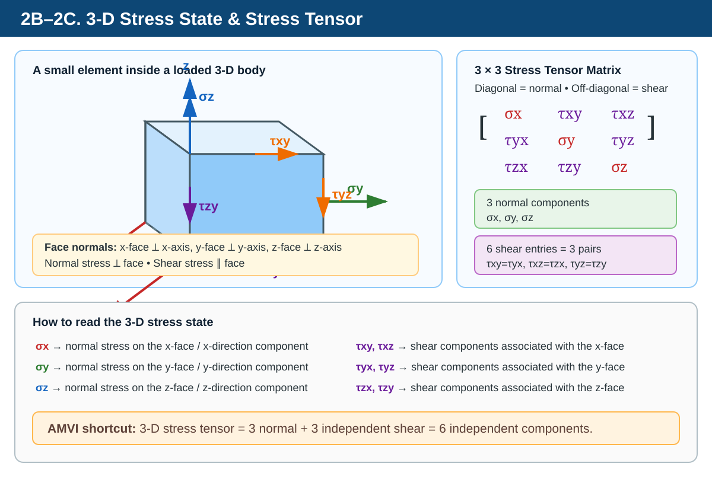

# Strength of Materials — Stress, Types of Stress & Direct Stress
## AMVI-MPSC Consolidated Notes

> **Purpose:** A single, deduplicated and exam-oriented note combining the three provided notes on **Stress, Types of Stress, and Direct Stress**.

---

# 1. Big Picture

When an external load acts on a body:

```text
External Load
     ↓
Body tends to deform
     ↓
Internal resistance develops
     ↓
Internal force is distributed over area
     ↓
STRESS
     ↓
Deformation / Strain
```

### Core idea

> **Stress is the internal resisting force developed in a body per unit area when the body is subjected to an external load.**

Stress is an **internal quantity**, while the applied load is an **external quantity**.

---

# 2. What is Stress?

## 2.1 Definition

**Stress** is the internal resisting force per unit cross-sectional area of a loaded body.

For a simple uniformly distributed axial load:

$$
\boxed{\sigma = \frac{P}{A}}
$$

Where:

- $\sigma$ = normal stress
- $P$ = axial load/internal force
- $A$ = cross-sectional area

### In simple words

> **Stress tells us how much internal force is acting on each unit area.**

---

# 2A. Stress is Tensorial in Nature

In a general 3-D state of stress, **stress is a second-order tensor**. It is not simply a scalar or a vector.

In simple Strength of Materials problems, we often calculate one stress component using:

$$
\sigma=\frac{P}{A}
$$

That single value represents a particular normal-stress component. However, the **complete stress state at a point in a 3-D body requires multiple stress components**, so it is represented by a stress tensor.

### Scalar vs Vector vs Tensor

| Quantity | What it describes | Example |
|---|---|---|
| Scalar | Magnitude only | Mass, temperature |
| Vector | Magnitude + direction | Force, velocity |
| Tensor | State/relationship involving multiple directions or planes | Stress, strain |

### ⭐ AMVI Point

> **Stress → second-order tensor**  
> **Strain → second-order tensor**  
> **Force → vector**  
> **Mass → scalar**

---

# 2B. 3-D Stress State



> **Diagram guide:** The three normal stresses are shown perpendicular to their respective faces, while the shear stresses are shown tangentially. The matrix at right shows the same information in tensor form.


Consider a small cube taken from inside a loaded 3-D body.

```text
                         z
                         ↑
                         │
                    ┌─────────┐
                   /│        /│
                  / │       / │
                 ┌─────────┐  │
                 │  │      │  │
              y ←│  │ CUBE │  │→ y
                 │  └──────│──┘
                 │ /       │ /
                 │/        │/
                 └─────────┘
                       → x
```

At a point in the cube, stresses can act in **three coordinate directions: x, y and z**.

## Normal stresses

Normal stress acts **perpendicular to the corresponding face**.

There are three normal stresses:

- $\sigma_x$ → normal stress associated with the x-direction
- $\sigma_y$ → normal stress associated with the y-direction
- $\sigma_z$ → normal stress associated with the z-direction

Conceptually:

```text
                 σz
                 ↑
                 │
          σy  ← [ CUBE ] →  σy
                 │
                 ↓
                 σz

                 σx acts
              along the x-axis
```

For a general 3-D stress state, think of these as the three **direct/normal stress components**.

## Shear stresses

Shear stress acts **parallel/tangential to a face**.

There are six stress components commonly written as:

- $\tau_{xy}$
- $\tau_{xz}$
- $\tau_{yx}$
- $\tau_{yz}$
- $\tau_{zx}$
- $\tau_{zy}$

For the usual classical stress tensor, the shear components are symmetric:

$$
\tau_{xy}=\tau_{yx},\qquad
\tau_{xz}=\tau_{zx},\qquad
\tau_{yz}=\tau_{zy}
$$

Therefore, there are **6 independent stress components** in the usual 3-D Cauchy stress state:

- 3 normal stresses
- 3 independent shear-stress pairs

---

# 2C. 3-D Stress Tensor Matrix

The complete stress state can be represented by the following **3 × 3 stress matrix**:

$$
[\sigma]=
\begin{bmatrix}
\sigma_x & \tau_{xy} & \tau_{xz}\\
\tau_{yx} & \sigma_y & \tau_{yz}\\
\tau_{zx} & \tau_{zy} & \sigma_z
\end{bmatrix}
$$

### How to read the matrix

The **diagonal terms** are the normal stresses:

$$
\boxed{\sigma_x,\ \sigma_y,\ \sigma_z}
$$

The **off-diagonal terms** are the shear stresses:

$$
\boxed{\tau_{xy},\ \tau_{xz},\ \tau_{yx},\ \tau_{yz},\ \tau_{zx},\ \tau_{zy}}
$$

So remember:

```text
              STRESS MATRIX
                   │
          ┌────────┴────────┐
          │                 │
       DIAGONAL         OFF-DIAGONAL
          │                 │
    Normal stresses     Shear stresses
          │                 │
   σx , σy , σz        τxy, τxz, τyx,
                       τyz, τzx, τzy
```

### ⭐ Easy memory trick

> **Diagonal = Normal**  
> **Off-diagonal = Shear**

---

# 2D vs 3D Stress — Quick Understanding

### 2-D stress state

Usually represented using:

$$
[\sigma]=
\begin{bmatrix}
\sigma_x & \tau_{xy}\\
\tau_{yx} & \sigma_y
\end{bmatrix}
$$

It contains:

- $\sigma_x$ → normal stress
- $\sigma_y$ → normal stress
- $\tau_{xy},\tau_{yx}$ → shear components

For the usual classical stress state:

$$
\tau_{xy}=\tau_{yx}
$$

### 3-D stress state

$$
[\sigma]=
\begin{bmatrix}
\sigma_x & \tau_{xy} & \tau_{xz}\\
\tau_{yx} & \sigma_y & \tau_{yz}\\
\tau_{zx} & \tau_{zy} & \sigma_z
\end{bmatrix}
$$

It contains:

- **3 normal stress components**
- **6 shear entries**
- **6 independent stress components overall** when shear symmetry is used

### AMVI exam shortcut

> **3-D stress tensor = 3 normal + 3 independent shear components = 6 independent components.**

# 3. Stress Classification

The most useful basic classification is based on the direction of stress relative to the area.

```text
                         STRESS
                           │
             ┌─────────────┴─────────────┐
             │                           │
       NORMAL STRESS               SHEAR STRESS
             │                           │
       ┌─────┴─────┐                     │
       │           │                     │
    TENSILE    COMPRESSIVE             SHEAR
```

## Remember

- **Normal stress → perpendicular to area**
- **Shear stress → parallel/tangential to area**

---

# 4. Normal Stress

## 4.1 Definition

Normal stress acts **perpendicular (normal)** to the cross-sectional area.

For a simple axial load:

$$
\boxed{\sigma = \frac{P}{A}}
$$

Normal stress has two basic forms:

1. **Tensile stress**
2. **Compressive stress**

---

# 5. Tensile Stress

## 5.1 Meaning

When a load tends to **pull or elongate** a body, tensile stress develops.

```text
        P →    ┌────────────────┐    ← P
                │      BAR       │
                └────────────────┘

                  ←── PULL ──→

                  Length increases
```

### Effect

- Length increases
- Elongation occurs
- Lateral dimensions generally decrease due to Poisson effect

### Formula

$$
\boxed{\sigma_t = \frac{P}{A}}
$$

### Sign convention

Tensile stress is generally taken as positive:

$$
\boxed{\sigma_t > 0}
$$

### Examples

- Tie rod
- Hanger
- Suspension rod
- Crane tie member
- Bolt under axial tension

### Memory

> **Tension → Pull → Elongation**

---

# 6. Compressive Stress

## 6.1 Meaning

When a load tends to **push or shorten** a body, compressive stress develops.

```text
        P ←    ┌────────────────┐    → P
                │      BAR       │
                └────────────────┘

                 →── PUSH ──←

                  Length decreases
```

### Effect

- Length decreases
- Shortening occurs
- Lateral dimensions generally increase

### Formula

$$
\boxed{\sigma_c = \frac{P}{A}}
$$

With the usual sign convention:

$$
\boxed{\sigma_c < 0}
$$

### Examples

- Columns
- Struts
- Pillars
- Compression members

### Memory

> **Compression → Push → Shortening**

---

# 7. Shear Stress

## 7.1 Definition

**Shear stress** acts **parallel or tangential** to the area.

It occurs when a force tends to make one part of a body **slide relative to another part**.

```text
          Shear force →
      ┌─────────────────┐
      │                 │
      │      BODY       │
      │                 │
      └─────────────────┘
```

For simple average shear stress:

$$
\boxed{\tau = \frac{P}{A}}
$$

Where:

- $\tau$ = shear stress
- $P$ = shear force
- $A$ = resisting area

> **Important:** $\tau=P/A$ gives **average shear stress**. In many real members, shear stress is not uniformly distributed.

### Effect

Shear stress tends to produce:

- Sliding
- Angular distortion

### Examples

- Pins
- Bolts in shear
- Rivets
- Punching operations
- Shafts under torsion

### Memory

> **Shear → Parallel → Sliding / Angular distortion**

---

# 8. Normal Stress vs Shear Stress

| Feature | Normal Stress | Shear Stress |
|---|---|---|
| Direction | Perpendicular to area | Parallel/tangential to area |
| Symbol | $\sigma$ | $\tau$ |
| Simple formula | $\sigma=P/A$ | $\tau=P/A$ |
| Typical loading | Axial tension/compression | Shear force |
| Typical deformation | Elongation/shortening | Sliding/angular distortion |
| Basic types | Tensile, compressive | Shear |

### ⭐ AMVI Rule

> **Normal = Perpendicular**  
> **Shear = Parallel**

---

# 9. Direct Stress

## 9.1 Definition

**Direct stress** is the stress produced when an external force acts **directly along the axis of a member**.

```text
                 Member axis
        ─────────────────────────→

       P →  ┌──────────────────┐  ← P
             │       BAR        │
             └──────────────────┘
```

The load is called a **direct/axial load**.

It can produce:

- Tensile direct stress
- Compressive direct stress

### Key relationship

$$
\boxed{\text{Direct Stress is a type of Normal Stress}}
$$

---

# 10. Direct Load and Concentric Loading

A direct load acts along the longitudinal axis of the member.

For a **concentric axial load**, the load passes through the centroidal axis of the cross-section.

```text
             P
             ↓
             │
        ┌─────────┐
        │    │    │
        │    │    │
        │    │    │
        └─────────┘
             │
        Centroidal axis
```

For the simple axial model:

> **Direct load → axial force → direct stress**

---

# 11. Direct Stress Formula

For a prismatic member carrying a concentric axial load:

$$
\boxed{\sigma = \frac{P}{A}}
$$

Rearranged forms:

$$
\boxed{P=\sigma A}
$$

$$
\boxed{A=\frac{P}{\sigma}}
$$

### Units

- $P$ → N or kN
- $A$ → m² or mm²
- $\sigma$ → Pa, MPa, N/mm²

### Important conversion

$$
\boxed{1\,N/mm^2=1\,MPa}
$$

Therefore, if load is in N and area is in mm²:

$$
\frac{N}{mm^2}
$$

is directly equal numerically to MPa.

---

# 12. Conditions for Using $\sigma=P/A$

The simple direct-stress equation is appropriate when the basic axial model applies:

- Load is axial
- Load acts along the member axis
- Load is concentric
- Cross-section is uniform for a prismatic member
- Stress distribution is treated as uniform away from local disturbances

```text
Axial load
    ↓
┌─────────────┐
│             │
│     BAR     │
│             │
└─────────────┘
    ↓
Uniform direct stress
over section
```

### ⭐ Exam point

> **Concentric axial loading on a uniform member → direct stress can be treated as uniformly distributed in the simple model.**

---

# 13. Effect of Load on Stress

From:

$$
\sigma=\frac{P}{A}
$$

For constant area:

$$
\boxed{\sigma\propto P}
$$

Therefore:

- Load increases → stress increases
- Load decreases → stress decreases
- Load doubles → stress doubles

### Example

If:

$$
P_2=2P_1
$$

then:

$$
\boxed{\sigma_2=2\sigma_1}
$$

---

# 14. Effect of Area on Stress

For constant load:

$$
\boxed{\sigma\propto\frac{1}{A}}
$$

Therefore:

- Area increases → stress decreases
- Area decreases → stress increases

If area is halved:

$$
A_2=\frac{A_1}{2}
$$

then:

$$
\boxed{\sigma_2=2\sigma_1}
$$

### ⭐ AMVI Point

> **Same load + smaller area = greater stress.**

---

# 15. Does Length Affect Direct Stress?

The direct stress equation is:

$$
\boxed{\sigma=\frac{P}{A}}
$$

Length $L$ does not appear in this equation.

Therefore, if load and area remain unchanged:

> **Changing the length does not directly change the average direct stress.**

However, length affects deformation.

For a uniform elastic axial member:

$$
\boxed{\delta=\frac{PL}{AE}}
$$

So:

```text
Stress:
σ = P/A
→ depends on load and area

Deformation:
δ = PL/(AE)
→ depends on load, length, area and E
```

### ⭐ AMVI Trap

> **Length affects elongation, not the simple average stress $P/A$, when load and area are unchanged.**

---

# 16. Direct Stress and Direct Strain

For an axially loaded elastic member:

### Direct stress

$$
\boxed{\sigma=\frac{P}{A}}
$$

### Direct strain

$$
\boxed{\varepsilon=\frac{\delta}{L}}
$$

Within the linear elastic range:

$$
\boxed{\sigma=E\varepsilon}
$$

Therefore:

$$
\boxed{E=\frac{\sigma}{\varepsilon}}
$$

---

# 17. Direct Stress and Deformation

For a uniform elastic bar:

$$
\boxed{\delta=\frac{PL}{AE}}
$$

Since:

$$
\sigma=\frac{P}{A}
$$

we can also write:

$$
\boxed{\delta=\frac{\sigma L}{E}}
$$

Therefore:

- Higher stress → greater deformation for same $L,E$
- Greater length → greater deformation
- Higher $E$ → smaller deformation for same stress

---

# 18. Direct Stress in a Stepped Bar

A stepped bar has different cross-sectional areas.

```text
P →  ┌──────────────┐
      │     A₁       │
      └──────┬───────┘
             │ A₂
             │
      ┌──────┴───────┐
      │              │
      └──────────────┘  ← P
```

If the same axial force $P$ passes through both portions:

$$
\boxed{\sigma_1=\frac{P}{A_1}}
$$

$$
\boxed{\sigma_2=\frac{P}{A_2}}
$$

If:

$$
A_2<A_1
$$

then:

$$
\boxed{\sigma_2>\sigma_1}
$$

### ⭐ Important

> **In a stepped bar carrying the same axial force, the smaller area experiences greater direct stress.**

---

# 19. Composite Member — Basic Concept

A composite member consists of two or more different materials acting together.

Examples:

- Steel and concrete
- Bonded multi-material members
- Reinforced components

Important points:

- Different materials can have different elastic properties.
- Stress sharing depends on stiffness and connection conditions.
- Do **not** automatically assume equal stress in different materials.
- Detailed composite-member analysis requires compatibility and load-sharing conditions.

---

# 20. Direct Stress vs Bending Stress

Both can produce **normal stress**, but their causes differ.

### Direct stress

Caused by an axial/direct force:

$$
\boxed{\sigma=\frac{P}{A}}
$$

For concentric axial loading, it is treated as uniform in the basic model.

### Bending stress

Caused by a bending moment:

$$
\boxed{\sigma=\frac{My}{I}}
$$

Bending stress varies across the section.

| Feature | Direct Stress | Bending Stress |
|---|---|---|
| Main cause | Axial force | Bending moment |
| Formula | $\sigma=P/A$ | $\sigma=My/I$ |
| Distribution | Uniform for ideal concentric axial loading | Varies across section |
| Stress nature | Tensile or compressive | Tensile on one side, compressive on the other |

---

# 21. Eccentric Load — Basic Concept

If an axial load does **not** pass through the centroidal axis, it is an **eccentric load**.

```text
        P
        ↓
        │
        │   e
        │   ↕
      ┌─────────┐
      │         │
      │    │    │ ← centroidal axis
      │    │    │
      └─────────┘
```

An eccentric load can produce:

- Direct stress
- Bending stress

Therefore:

$$
\boxed{\text{Total stress}=\text{Direct stress}+\text{Bending stress}}
$$

The detailed calculation belongs to the **Direct and Bending Stresses** topic.

### ⭐ AMVI Point

> **Concentric axial load → direct stress in the simple model.**  
> **Eccentric axial load → direct + bending stress.**

---

# 22. Single Shear and Double Shear

## 22.1 Single shear

There is **one shear plane**.

If the area of one shear plane is $A$:

$$
\boxed{\tau=\frac{P}{A}}
$$

```text
        P →
     ┌───────┐
     │  PIN  │
     └───────┘
        ↑
    1 shear plane
```

## 22.2 Double shear

There are **two shear planes**.

If each plane has area $A$:

$$
\boxed{\tau=\frac{P}{2A}}
$$

```text
        P →
   ┌───────────┐
   │   PIN     │
   └───────────┘
     ↑       ↑
   Plane 1 Plane 2
```

Therefore, for the same load and same individual plane area:

$$
\boxed{\tau_{double}=\frac{1}{2}\tau_{single}}
$$

### ⭐ Memory

> **Single shear → 1 plane → $P/A$**  
> **Double shear → 2 planes → $P/(2A)$**

---

# 23. Bending and Torsion — Where They Fit

## Bending

Bending of a beam can produce normal stresses:

- Tensile on one side
- Compressive on the other side

## Torsion

Torsion of a shaft primarily produces **shear stress**.

```text
Bending → Normal stress
Torsion → Shear stress
```

Detailed bending and torsion equations are studied separately.

---

# 24. Stress, Force, Strain — Do Not Confuse

| Quantity | Meaning | Unit |
|---|---|---|
| Force | External/internal force | N, kN |
| Stress | Force per unit area | Pa, MPa, N/mm² |
| Strain | Deformation per original dimension | Dimensionless |

### Key formulas

$$
\boxed{\sigma=\frac{P}{A}}
$$

$$
\boxed{\varepsilon=\frac{\delta}{L}}
$$

$$
\boxed{\sigma=E\varepsilon}
$$

---

# 25. Stress and Pressure

Stress and pressure have the **same SI unit and dimensions**, but they are different physical concepts.

| Feature | Stress | Pressure |
|---|---|---|
| Origin | Internal resistance in a material | Normal force exerted by fluid/surface |
| Can be tensile? | Yes | Normally no |
| Can be shear? | Yes, as shear stress | Pressure is normal |
| Symbol | $\sigma,\tau$ | $p$ |
| Unit | Pa | Pa |

### Exam point

> **Stress and pressure have the same dimensions and SI unit, but they are not the same physical concept.**

---

# 26. Units and Dimensions of Stress

## SI unit

$$
\boxed{Pa=N/m^2}
$$

Common units:

- Pa
- kPa
- MPa
- GPa
- N/mm²

Important conversion:

$$
\boxed{1\,N/mm^2=1\,MPa}
$$

## Dimensions

Since:

$$
\sigma=\frac{P}{A}
$$

Force dimensions:

$$
[F]=MLT^{-2}
$$

Area dimensions:

$$
[A]=L^2
$$

Therefore:

$$
[\sigma]=\frac{MLT^{-2}}{L^2}
$$

$$
\boxed{[\sigma]=ML^{-1}T^{-2}}
$$

---

# 27. Numerical Examples

## Example 1 — Tensile Direct Stress

A rod has area $500\,mm^2$ and carries an axial tensile load of $50\,kN$. Find the stress.

Given:

$$
P=50,000\,N
$$

$$
A=500\,mm^2
$$

$$
\sigma=\frac{P}{A}
$$

$$
\sigma=\frac{50,000}{500}
$$

$$
\boxed{\sigma=100\,MPa}
$$

---

## Example 2 — Compressive Stress

A short column carries $150\,kN$ on an area of $3000\,mm^2$.

$$
\sigma_c=\frac{150,000}{3000}
$$

$$
\boxed{\sigma_c=50\,MPa}
$$

With sign convention:

$$
\boxed{\sigma_c=-50\,MPa}
$$

---

## Example 3 — Required Area

A tie rod carries $80\,kN$. Allowable stress is $100\,MPa$. Find the required area.

$$
A=\frac{P}{\sigma}
$$

$$
A=\frac{80,000}{100}
$$

$$
\boxed{A=800\,mm^2}
$$

---

## Example 4 — Effect of Area

A rod carries constant load. Area changes from $400\,mm^2$ to $200\,mm^2$. Original stress is $50\,MPa$.

Area is halved, so stress doubles:

$$
\boxed{\sigma_2=100\,MPa}
$$

---

## Example 5 — Average Shear Stress

A pin carries a shear force of $12\,kN$ and has one resisting shear-plane area of $300\,mm^2$.

$$
\tau=\frac{12,000}{300}
$$

$$
\boxed{\tau=40\,MPa}
$$

---

# 28. AMVI-MPSC High-Yield Points

1. Stress is internal resisting force per unit area.
2. Stress is an internal quantity.
3. Stress is broadly classified into normal and shear stress.
4. Normal stress acts perpendicular to the area.
5. Shear stress acts parallel/tangential to the area.
6. Normal stress is represented by $\sigma$.
7. Shear stress is represented by $\tau$.
8. Tensile stress is a type of normal stress.
9. Compressive stress is a type of normal stress.
10. Tensile load produces elongation.
11. Compressive load produces shortening.
12. Shear loading produces sliding/angular distortion.
13. Direct stress is a type of normal stress.
14. Direct stress is produced by an axial/direct load.
15. Basic direct stress formula is $\sigma=P/A$.
16. Average simple shear stress is $\tau=P/A$.
17. At constant area, stress is directly proportional to load.
18. At constant load, stress is inversely proportional to area.
19. Smaller area means greater stress for the same load.
20. Length does not appear in $\sigma=P/A$.
21. Length affects axial deformation through $\delta=PL/(AE)$.
22. For a stepped bar carrying the same axial force, the smaller area has greater stress.
23. Do not automatically assume equal stress in different materials of a composite member.
24. Concentric axial loading gives direct stress in the simple model.
25. Eccentric axial loading can produce direct + bending stress.
26. Bending produces normal stress.
27. Torsion of a shaft produces shear stress.
28. Single shear has one resisting shear plane.
29. Double shear has two resisting shear planes.
30. For equal individual plane areas, double-shear average stress is half the single-shear value.
31. Tensile stress is generally positive.
41. In a general 3-D state, stress is a **second-order tensor**.
42. The 3-D stress tensor is represented by a **3 × 3 matrix**.
43. Diagonal entries of the stress matrix represent normal stresses.
44. Off-diagonal entries represent shear-stress components.
45. The usual 3-D Cauchy stress state has **6 independent components** because shear stresses are symmetric in classical continuum mechanics.
46. $\sigma_x$, $\sigma_y$, and $\sigma_z$ are the three normal stress components.
47. $	au_{xy}$, $	au_{xz}$, $	au_{yx}$, $	au_{yz}$, $	au_{zx}$, and $	au_{zy}$ are shear-stress entries.
48. In the usual classical stress tensor, $	au_{xy}=	au_{yx}$, $	au_{xz}=	au_{zx}$, and $	au_{yz}=	au_{zy}$.
32. Compressive stress is generally negative.
33. Stress has units; strain is dimensionless.
34. $1\,N/mm^2=1\,MPa$.
35. Stress dimensions are $ML^{-1}T^{-2}$.
36. Stress and pressure have the same dimensions and SI unit.
37. Stress and pressure are not the same physical concept.
38. Within the linear elastic range, $\sigma=E\varepsilon$.
39. Direct stress is normal stress produced by direct axial loading.
40. **Normal = perpendicular; Shear = parallel.**

---

# 29. AMVI-MPSC MCQs

### MCQ 1
Stress is:

A. External force  
B. Internal resisting force per unit area  
C. Deformation per unit length  
D. Energy stored in a body  

**Answer: B**

### MCQ 2
Normal stress acts:

A. Parallel to the area  
B. Perpendicular to the area  
C. At 45° only  
D. Tangentially only  

**Answer: B**

### MCQ 3
Shear stress acts:

A. Perpendicular to the area  
B. Parallel/tangential to the area  
C. Only vertically  
D. Only horizontally  

**Answer: B**

### MCQ 4
Tensile stress is a type of:

A. Shear stress  
B. Normal stress  
C. Torsional stress  
D. Pressure  

**Answer: B**

### MCQ 5
A tensile load generally causes:

A. Shortening  
B. Elongation  
C. Twisting only  
D. No deformation  

**Answer: B**

### MCQ 6
A compressive load generally causes:

A. Elongation  
B. Shortening  
C. Sliding only  
D. No stress  

**Answer: B**

### MCQ 7
The basic direct-stress formula is:

A. $P A$  
B. $P/A$  
C. $A/P$  
D. $P/L$  

**Answer: B**

### MCQ 8
Direct stress is a type of:

A. Normal stress  
B. Shear stress  
C. Fluid pressure  
D. Torsional stress only  

**Answer: A**

### MCQ 9
If load doubles and area remains constant, direct stress:

A. Halves  
B. Doubles  
C. Remains unchanged  
D. Becomes four times  

**Answer: B**

### MCQ 10
If area doubles and load remains constant, direct stress:

A. Doubles  
B. Halves  
C. Becomes four times  
D. Remains unchanged  

**Answer: B**

### MCQ 11
Which quantity does not directly appear in $\sigma=P/A$?

A. Load  
B. Area  
C. Length  
D. Stress  

**Answer: C**

### MCQ 12
If the length of a uniform bar is doubled while load and area remain unchanged, average direct stress:

A. Doubles  
B. Halves  
C. Remains unchanged  
D. Becomes four times  

**Answer: C**

### MCQ 13
If the length is doubled while all other quantities remain unchanged, axial deformation:

A. Doubles  
B. Halves  
C. Remains unchanged  
D. Becomes zero  

**Answer: A**

### MCQ 14
A stepped bar carries the same axial force in two portions. The smaller-area portion has:

A. Smaller stress  
B. Greater stress  
C. Zero stress  
D. Always the same stress  

**Answer: B**

### MCQ 15
A shaft subjected to torque primarily develops:

A. Tensile stress only  
B. Compressive stress only  
C. Shear stress  
D. Zero stress  

**Answer: C**

### MCQ 16
A beam under bending develops:

A. Only tensile stress  
B. Only compressive stress  
C. Tensile and compressive normal stresses  
D. Only shear stress everywhere  

**Answer: C**

### MCQ 17
An eccentric axial load can produce:

A. Direct stress only  
B. Bending stress only  
C. Direct + bending stress  
D. No stress  

**Answer: C**

### MCQ 18
In double shear, compared with single shear for the same load and same individual shear-plane area, average shear stress is:

A. Double  
B. Half  
C. Four times  
D. Unchanged  

**Answer: B**

### MCQ 19
The SI unit of stress is:

A. N  
B. J  
C. Pa  
D. m  

**Answer: C**

### MCQ 20
Which conversion is correct?

A. $1\,N/mm^2=1\,kPa$  
B. $1\,N/mm^2=1\,MPa$  
C. $1\,N/mm^2=1\,GPa$  
D. $1\,N/mm^2=100\,MPa$  

**Answer: B**

### MCQ 21
The dimensions of stress are:

A. $MLT^{-2}$  
B. $ML^{-1}T^{-2}$  
C. $ML^2T^{-2}$  
D. $M^{-1}LT^{-2}$  

**Answer: B**

### MCQ 22
Which relation is Hooke's law for direct loading?

A. $\sigma=P/A$  
B. $\sigma=E\varepsilon$  
C. $\delta=PL/(AE)$  
D. $\tau=P/A$  

**Answer: B**

### MCQ 23
Which statement is correct?

A. Stress is dimensionless  
B. Strain has unit Pa  
C. Stress has units while strain is dimensionless  
D. Stress is measured in metres  

**Answer: C**

### MCQ 24
For a concentric axial load on a uniform member, direct stress is ideally:

A. Zero  
B. Uniformly distributed  
C. Maximum only at the center  
D. Maximum only at the edge  

**Answer: B**

### MCQ 25
Which is correctly matched?

A. Tension → shortening  
B. Compression → elongation  
C. Shear → angular distortion  
D. Normal stress → parallel to area  

**Answer: C**

---

# 30. Quick Formula Sheet

## Stress

$$
\boxed{\sigma=\frac{P}{A}}
$$

## Load

$$
\boxed{P=\sigma A}
$$

## Required area

$$
\boxed{A=\frac{P}{\sigma}}
$$

## Average shear stress

$$
\boxed{\tau=\frac{P}{A}}
$$

## Double shear

$$
\boxed{\tau=\frac{P}{2A}}
$$

## Direct strain

$$
\boxed{\varepsilon=\frac{\delta}{L}}
$$

## Axial deformation

$$
\boxed{\delta=\frac{PL}{AE}}
$$

## Hooke's law

$$
\boxed{\sigma=E\varepsilon}
$$

## Bending stress

$$
\boxed{\sigma=\frac{My}{I}}
$$

## Stress conversion

$$
\boxed{1\,N/mm^2=1\,MPa}
$$

## Stress dimensions

$$
\boxed{[\sigma]=ML^{-1}T^{-2}}
$$

---

# 31. One-Page Memory Map

```text
                         STRESS
                           │
            ┌──────────────┴──────────────┐
            │                             │
       NORMAL STRESS                 SHEAR STRESS
            │                             │
       ┌────┴────┐                        │
       │         │                        │
    TENSILE  COMPRESSIVE                SHEAR
       │         │                        │
     PULL       PUSH                 PARALLEL
       │         │                        │
   ELONGATE    SHORTEN              SLIDE / ANGULAR
       │         │
       └────┬────┘
            │
       DIRECT STRESS
            │
        Axial load
            │
         σ = P/A
```

## Final AMVI Memory Trick

> **Tension = Pull = Long**  
> **Compression = Push = Short**  
> **Normal = Perpendicular**  
> **Shear = Parallel**  
> **Direct stress = Axial load → $P/A$**  
> **Smaller area → Greater stress**  
> **Longer bar → Greater deformation, not greater $P/A$ stress**  
> **Concentric load → Direct stress**  
> **Eccentric load → Direct + Bending stress**  
> **Torsion → Shear stress**  
> **Double shear → 2 shear planes**  
> **$1\,N/mm^2=1\,MPa$**
